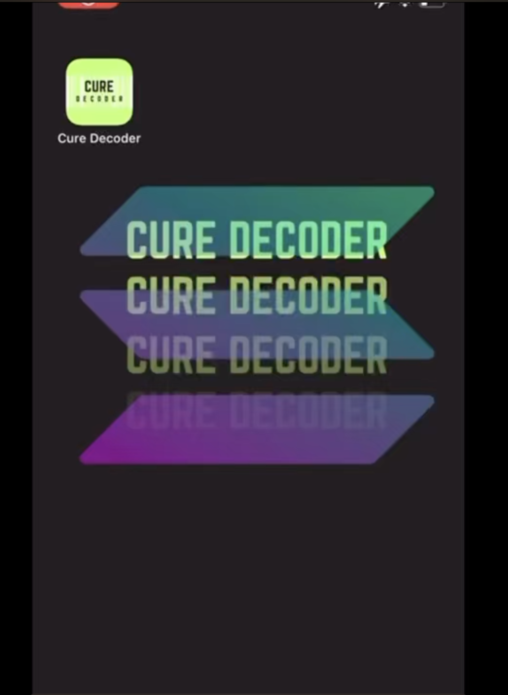

# Cure Decoder 
  * Health care app built to Save peoples lives by implementing blockchain to track the entire supply chain of medications, from manufacturer to consumer using Solana.

## Video Demo 
* 

## Team
* Fadi Ibrahim - https://www.linkedin.com/in/fadiibrahim/
* Ali Payne - https://www.linkedin.com/in/ali-payne/
* Advisor - Cessiah Lopez - https://uk.linkedin.com/in/cessiahlopez 

## link to pitch deck
<a href="https://github.com/payneal/cure_decoder/blob/main/pitch_deck/Cure Decoder Pitch Deck Presentation.pdf" target="_blank">Pitch Deck for Cure Decoder.</a>

## Why use Solona
* Supply Chain Traceability:
    * Implement blockchain to track the entire supply chain of medications, from manufacturer to consumer.
         * This can help users verify the authenticity and origin of their medication, reducing the risk of counterfeit drugs.
* Multi-Language Support:
    * Use blockchain to enable multilingual support. Smart contracts can automatically translate medication information into the user's preferred language, making it accessible to a wider global audience.
* Decentralized Verification: Any centralized system that can go down.
* Allow users and healthcare professionals to validate the accuracy of medication information and warnings.
    * Blockchain can facilitate a decentralized network of validators to cross-verify data.
* Smart Contracts: 
    * Implement smart contracts to send automatic alerts to users when there are recalls, safety warnings, or updates related to their medications.
* Interoperability: 
     * Use blockchain to ensure interoperability with other healthcare systems and electronic health records (EHRs), making it easier for healthcare professionals to access accurate medication information.
* Audit Trails for Regulatory Compliance:
      * Maintain detailed audit trails on the blockchain to demonstrate compliance with healthcare regulations, providing transparency to regulators and partners.
* Store the info using Solana API, so patients can grab the data and read the data straightaway.
* Use Solana to decentralise the information.
* Use Solana because it’s really fast for transactions and also have a proof of history
* Transactions of medicine using smart contracts
* transaction of medicines to be easier through smart contracts for providers and patients
* Proof of history = valuable for provider e.g. metadata

## Folder Structure
* videos 
    * additional videos of the prodict including demo
* mobile_app
    * react-native moble app connected with google vision api
* solana_service
    * python api server to make solona api calls
* walgreen-python-api
    * python api used for pharmaceutical info
* Resources
    * ideas/research 

## Real World Examples as to how Cure Decoded would improve the Pharmacy Industry:
* Prescription incident' leads to termination of woman's in vitro fertilization
* 
 
* UT linebacker's tragic fentanyl overdose story told by mom
*  
